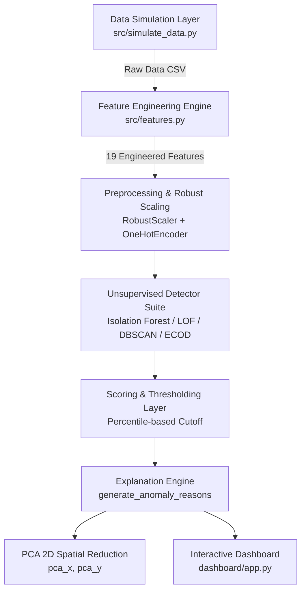
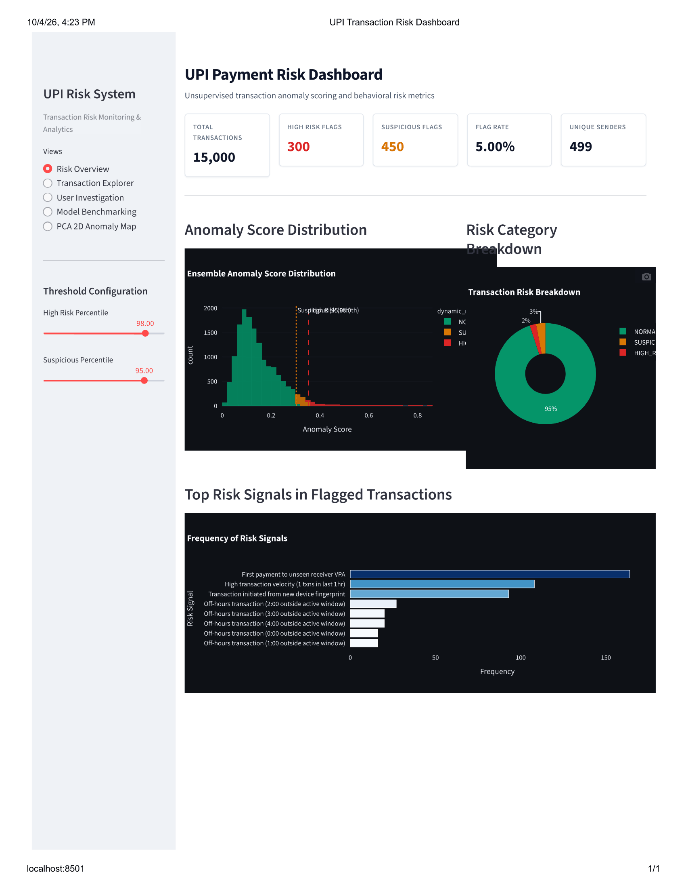
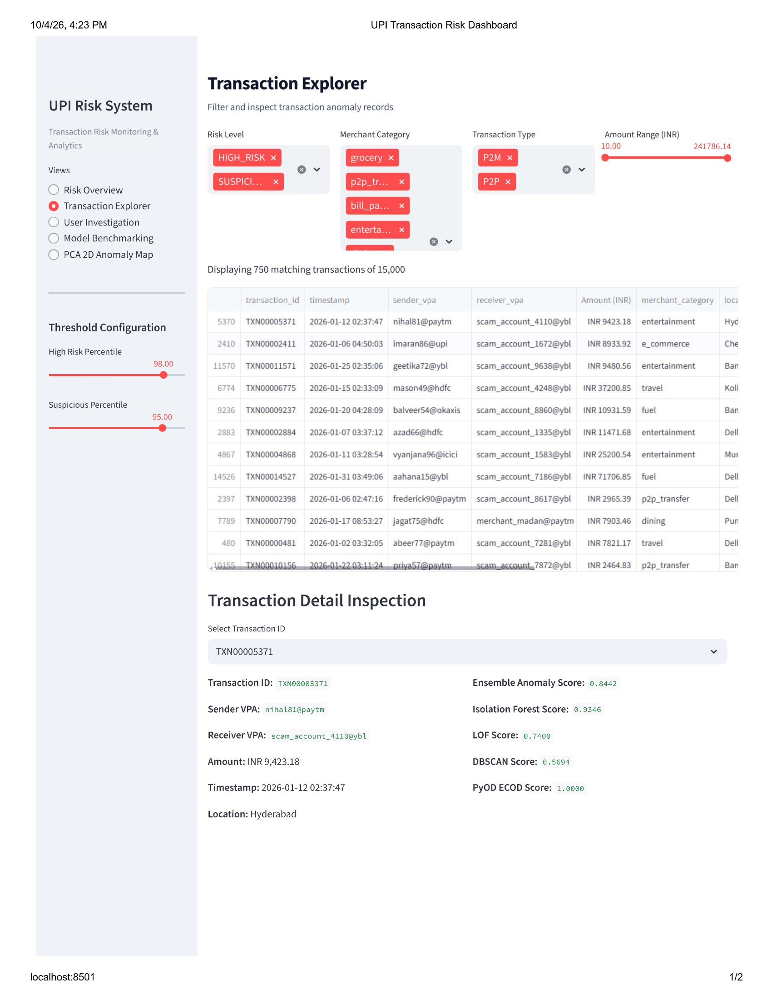
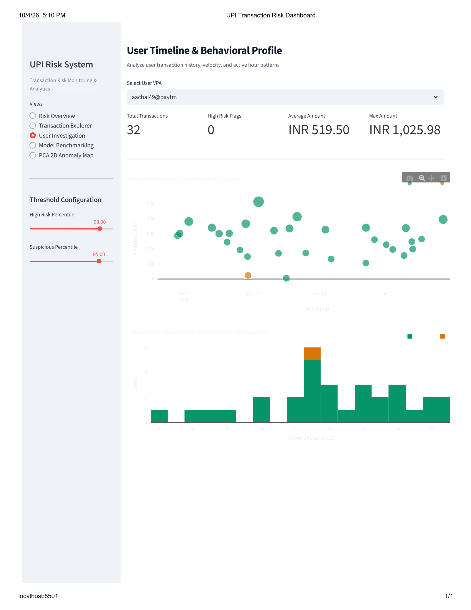
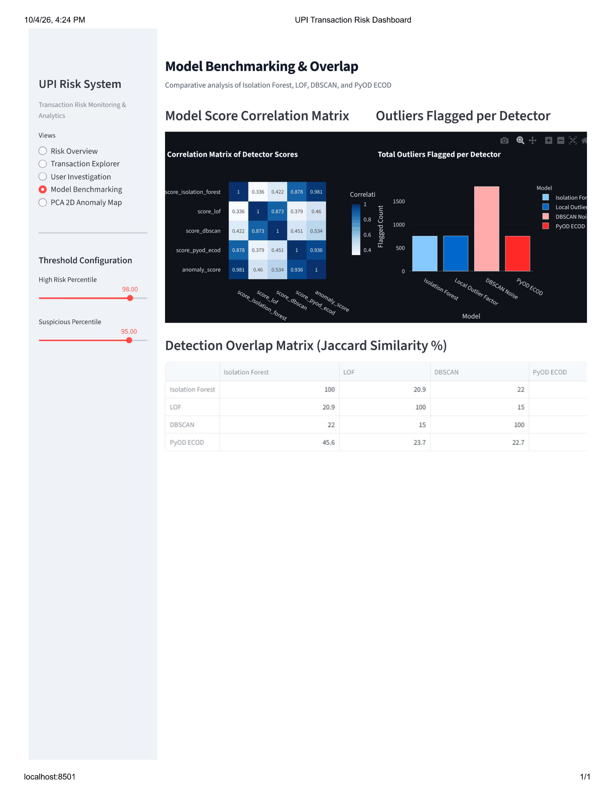
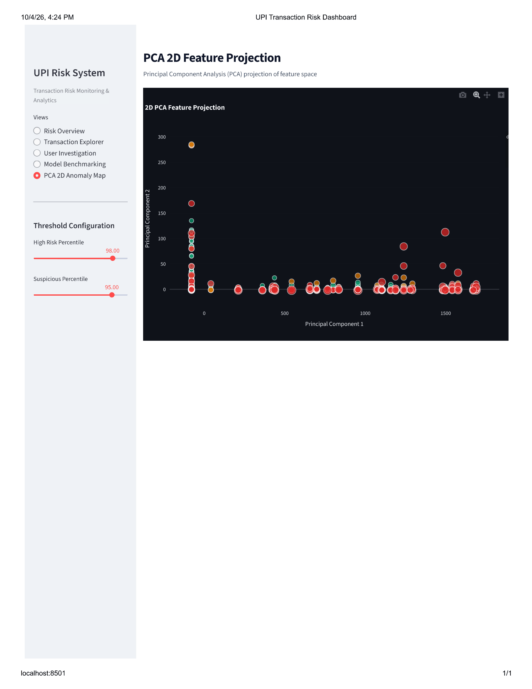

# UPI Digital Payment Anomaly Detection Engine

An unsupervised machine learning pipeline and transaction risk monitoring system for detecting behavioral anomalies in Unified Payments Interface (UPI) payment streams without ground-truth fraud labels.

---

## Project Overview

Digital payment networks process millions of daily transactions, but labeled fraud datasets are rare, heavily skewed, or unavailable due to banking privacy regulations. This project implements an end-to-end **unsupervised anomaly detection solution** that flags suspicious UPI payments by quantifying behavioral deviations from historical user profiles.

### Core Capabilities
- **Reproducible Data Simulation:** Generates 15,000 synthetic transactions across 500 user profiles with custom spend distributions, active hours, favorite merchant categories, and device fingerprints.
- **19 Domain-Engineered Features:** Velocity counts (1h/24h/7d), time deltas, amount Z-scores, rolling standard deviations, Shannon entropy of spending categories, active hour deviations, and geographic distance jumps.
- **Data Leakage Safeguard:** Features are computed strictly using past transactions prior to each event. Injected anomaly indicators are isolated exclusively for post-hoc evaluation.
- **Multi-Detector Suite:** Benchmarks global tabular detectors (**Isolation Forest**), local density detectors (**LOF**), density clustering (**DBSCAN**), and empirical CDF detectors (**PyOD ECOD**).
- **Percentile Thresholding:** Ranks risk levels into `HIGH_RISK` (Top 2%) and `SUSPICIOUS` (Top 5%) without relying on supervised labels.
- **Deterministic Explanation Engine:** Generates human-readable risk signals (e.g., *"Amount spike 8.5x user average | First payment to unseen receiver VPA | Geographic jump 1,200 km"*).
- **Interactive Dashboard:** Built with **Streamlit** and **Plotly** featuring risk KPIs, transaction filter tools, user timeline analysis, model overlap matrices, and 2D PCA cluster maps.

---

## System Architecture & Data Flow



---

## Dashboard Visual Analytics & Screenshots

Place your converted PNG screenshot files into `docs/images/` to display live visual previews:

### 1. Risk Overview Dashboard

*Executive telemetry summary displaying transaction count KPIs, flag rates, ensemble score distributions, and top triggered risk signals.*

---

### 2. Transaction Explorer & Risk Drilldown

*Filterable payment transaction table with multi-column controls and detailed risk signal inspection.*

---

### 3. User Behavioral Profile & Timeline Investigation

*Chronological user payment timeline scatter plot with amount Z-score bubble scaling and active hour histograms.*

---

### 4. Model Benchmarking & Overlap

*Detector score correlation matrix, outliers flagged per detector, and Jaccard overlap between detectors.*

---

### 5. PCA 2D Feature Projection Map

*Principal Component Analysis 2D projection of the feature space, with points colored by risk level.*

---

## Repository Structure

```text
upi-anomaly-detection/
├── data/
│   ├── raw/                  # Generated raw transaction logs & user profiles
│   └── processed/            # Feature-engineered & anomaly-scored datasets
├── notebooks/
│   ├── 01_data_simulation.ipynb
│   ├── 02_feature_engineering.ipynb
│   ├── 03_modeling_comparison.ipynb
│   └── 04_evaluation_visualization.ipynb
├── docs/                     # Visual screenshots & study materials
│   ├── images/
│   │   ├── risk_overview.png
│   │   ├── transaction_explorer.png
│   │   ├── user_investigation.png
│   │   ├── model_benchmarking.png
│   │   └── pca_2d_map.png
│   ├── BEGINNER_GLOSSARY.md
│   └── INTERVIEW_QA.md
├── src/
│   ├── simulate_data.py      # Faker & NumPy transaction generator
│   ├── features.py           # Feature engineering engine
│   ├── models.py             # Model training, scoring, thresholding & reasons
│   └── utils.py              # Helpers, geographic distance & data loaders
├── dashboard/
│   └── app.py                # Streamlit risk monitoring web app
├── config.py                 # Hyperparameters, paths & threshold settings
├── requirements.txt          # Python dependencies
├── README.md                 # Master project documentation
├── STUDY_NOTES.md            # Study notes
```

---

## Execution Guide

### 1. Environment Setup
Install dependencies:

```bash
pip install -r requirements.txt
```

### 2. Execute End-to-End Pipeline
Run the modular pipeline in sequence:

```bash
# Step 1: Generate synthetic transactions (15,000 records across 500 users)
python src/simulate_data.py

# Step 2: Compute velocity, amount Z-score, entropy, and spatial features
python src/features.py

# Step 3: Train unsupervised models, normalize anomaly scores & generate risk reasons
python src/models.py
```

### 3. Launch Interactive Risk Dashboard
Launch the Streamlit application:

```bash
python -m streamlit run dashboard/app.py
```

Open `http://localhost:8501` in your browser.

---

## Pipeline Summary & Key Findings

- **Total Generated Transactions:** 15,000
- **Unique User Senders:** 499
- **Injected Synthetic Anomalies:** 375 (2.50%)
- **Engineered Features:** 19
- **Model Overlap:** Isolation Forest & LOF show ~20.9% overlap, while Isolation Forest & DBSCAN show ~22.0% overlap on flagged points.
- **Post-Hoc Sanity Check:** Top 2% percentile high-risk cutoff captured 80 of the most severe multi-vector injected synthetic anomalies.

---

## Limitations

1. **Synthetic Data:** The transaction dataset is synthetically generated using Faker and NumPy distributions for educational/portfolio demonstration.
2. **Unsupervised Context:** Because real ground-truth fraud labels are absent in production, thresholding relies on percentile cutoffs rather than supervised metrics like Precision/Recall.
3. **Synthetic Sanity Check Notice:** Injected anomaly indicators are used **only** for post-hoc validation and are **never** passed to model training features.

---

## Tech Stack

- **Language:** Python 3.13
- **Data Engineering:** Pandas, NumPy, Faker
- **Machine Learning:** scikit-learn (IsolationForest, LOF, DBSCAN), PyOD (ECOD)
- **Visualization:** Plotly, Seaborn, Matplotlib
- **Dashboard:** Streamlit

