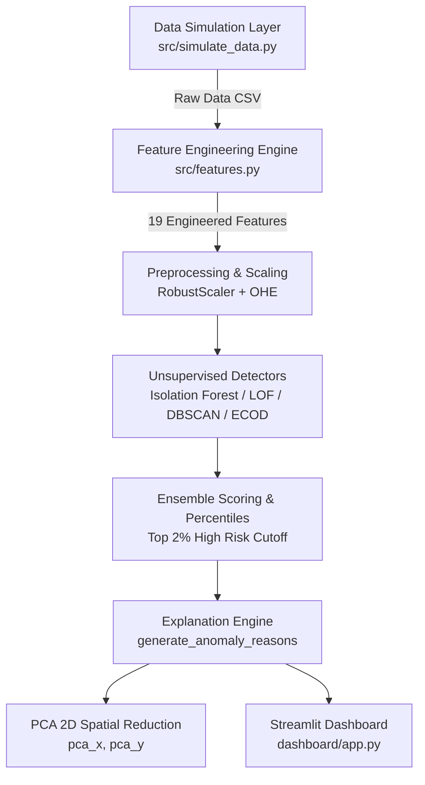

# Beginner Study Guide: UPI Digital Payment Anomaly Detection

> **Target Audience:** Anyone preparing for a project review, technical assessment, data science interview, or capstone evaluation.
> **Source of Truth:** Based on the working implementation in `d:\projects\upi`.

---

## Table of Contents
1. [What Are We Building? (The Core Problem)](#1-what-are-we-building-the-core-problem)
2. [Mental Model: The 8-Step Project Pipeline](#2-mental-model-the-8-step-project-pipeline)
3. [System Architecture](#3-system-architecture)
4. [Dataset Breakdown: Column-by-Column](#4-dataset-breakdown-column-by-column)
5. [Synthetic Data & Anomaly Injection](#5-synthetic-data--anomaly-injection)
6. [Python Concepts Used in This Project](#6-python-concepts-used-in-this-project)
7. [Pandas & NumPy Essentials](#7-pandas--numpy-essentials)
8. [Timestamp & Time-Window Math](#8-timestamp--time-window-math)
9. [Feature Engineering (The 19 Behavioral Features)](#9-feature-engineering-the-19-behavioral-features)
10. [Mathematics Made Simple (Mean, Std Dev, Z-Score, Entropy)](#10-mathematics-made-simple-mean-std-dev-z-score-entropy)
11. [Data Leakage — Extremely Important](#11-data-leakage--extremely-important)
12. [Preprocessing & Scaling (RobustScaler + OneHotEncoder)](#12-preprocessing--scaling-robustscaler--onehotencoder)
13. [Machine Learning Basics (Supervised vs Unsupervised)](#13-machine-learning-basics-supervised-vs-unsupervised)
14. [Isolation Forest Explained](#14-isolation-forest-explained)
15. [Local Outlier Factor (LOF) Explained](#15-local-outlier-factor-lof-explained)
16. [DBSCAN Clustering & Continuous Scoring](#16-dbscan-clustering--continuous-scoring)
17. [PyOD ECOD Detector](#17-pyod-ecod-detector)
18. [Ensemble Anomaly Scoring & Percentile Thresholding](#18-ensemble-anomaly-scoring--percentile-thresholding)
19. [Deterministic Explanation Engine](#19-deterministic-explanation-engine)
20. [Principal Component Analysis (PCA 2D Spatial Reduction)](#20-principal-component-analysis-pca-2d-spatial-reduction)
21. [Streamlit FinTech Dashboard Architecture](#21-streamlit-fintech-dashboard-architecture)
22. [Viva / Interview Quick-Fire Cheat Sheet](#22-viva--interview-quick-fire-cheat-sheet)

---

## 1. What Are We Building? (The Core Problem)

### Real-World Context
Unified Payments Interface (UPI) processes **billions of payments every month** (via apps like PhonePe, Google Pay, Paytm, and BHIM). 

In any payment system, a tiny fraction of transactions are suspicious or fraudulent. For example:
- A user's phone gets stolen.
- A user falls for a phishing scam.
- A high-velocity automated script initiates rapid transactions.

### The Problem
In real banking settings, **fraud labels (1 = fraud, 0 = normal) do NOT exist when a transaction happens**. 
Fraud reports arrive weeks or months later after customer complaints and police investigations. Furthermore, banking data privacy laws prevent sharing historical fraud databases.

### Our Solution: Unsupervised Anomaly Detection
Instead of training a model on past fraud labels, we ask:
> *"Which transactions deviate significantly from a user's normal historical behavior?"*

#### Simple Comparison Example:
```text
NORMAL BEHAVIOR (Shivam):
- Usually pays INR 200 – INR 1,000 for groceries/dining.
- Transacts between 8:00 AM and 10:00 PM.
- Uses his Samsung phone in Mumbai.
- Pays 4-5 regular merchants.

ANOMALOUS TRANSACTION:
- At 3:12 AM, a payment of INR 45,000 happens.
- Originates from a new Rogue Device fingerprint.
- Paid to a brand new unknown receiver VPA in Delhi.
- Shivam has already made 6 rapid payments in the last 10 minutes.
```
Our pipeline automatically detects this deviation, scores it, flags it as `HIGH_RISK`, and generates plain-text reasons for risk analysts.

---

## 2. Mental Model: The 8-Step Project Pipeline

```text
1. GENERATE SYNTHETIC DATA  -->  Faker + NumPy creates 15,000 raw transactions & 500 users
        ↓
2. UNDERSTAND RAW DATA      -->  Inspect columns (amount, sender_vpa, timestamp, location, device_id)
        ↓
3. ENGINEER FEATURES        -->  Calculate 19 behavioral features (Z-scores, velocity, entropy)
        ↓
4. PREPROCESS & SCALE       -->  RobustScaler for numericals + OneHotEncoder for categoricals
        ↓
5. TRAIN DETECTORS          -->  Isolation Forest, LOF, DBSCAN, PyOD ECOD
        ↓
6. CALCULATE ENSEMBLE SCORE -->  Combine scores into uniform [0, 1] range & percentile thresholds
        ↓
7. EXPLAIN RISK REASONS     -->  Rule engine converts feature anomalies to readable text
        ↓
8. DISPLAY DASHBOARD        -->  Interactive Streamlit app with tables, timelines & PCA maps
```

---

## 3. System Architecture



---

## 4. Dataset Breakdown: Column-by-Column

The raw dataset `data/raw/upi_transactions_raw.csv` contains 15,000 rows. Each row represents a single UPI payment transaction.

| Column | Type | Example | Why it Matters | How Project Uses It |
|---|---|---|---|---|
| `transaction_id` | String | `TXN00000042` | Unique key per transaction | Tracking and UI filtering |
| `sender_vpa` | String | `shivam34@okaxis` | Sender's payment identity | Grouping historical user profiles |
| `receiver_vpa` | String | `merchant_grocery@upi` | Receiver's payment address | Detecting new/unknown receivers |
| `amount` | Float | `12450.00` | Payment value in INR | Calculating Z-scores & amount spikes |
| `timestamp` | Datetime | `2026-01-15 03:12:45` | Date and exact time | Computing 1h/24h velocity & off-hours |
| `merchant_category` | Category | `grocery`, `fuel`, `dining` | Type of merchant | Entropy & category transition flags |
| `transaction_type` | Category | `P2P` or `P2M` | Person-to-Person vs Merchant | Categorical encoding feature |
| `device_id` | String | `Android_Samsung` | Device hardware fingerprint | Detecting rogue/unseen device logins |
| `location` | Category | `Mumbai`, `Delhi` | Transaction city | Distance jump calculation (KM) |
| `payment_status` | Category | `SUCCESS` or `FAILED` | Transaction outcome | Filtering failed high-risk bursts |

---

## 5. Synthetic Data & Anomaly Injection

### Why Synthetic Data?
Real UPI transaction datasets cannot be published due to banking confidentiality. We generate synthetic data using Python's `Faker` library and `NumPy` random distributions.

### User Profiles (`data/raw/user_profiles.json`)
We create 500 distinct synthetic users. Each user has:
- `mean_amount` and `std_amount` (e.g. User A typically spends INR 300 ± INR 80).
- `active_start_hour` and `active_end_hour` (e.g. 8 AM to 10 PM).
- `home_location` (one of 8 major Indian cities).
- `primary_device` (e.g. `iOS_iPhone`).
- `favorite_categories` & `frequent_receivers`.

### Injected Anomaly Patterns (375 Injected = 2.5%)
1. **`AMOUNT_SPIKE`**: Transaction amount is 8x to 22x higher than user's normal average.
2. **`VELOCITY_BURST`**: Multiple rapid transactions in a short window.
3. **`NEW_RECEIVER`**: High-value transfer to an unseen receiver VPA.
4. **`NEW_DEVICE`**: Payment from an unrecognized hardware device ID.
5. **`LOCATION_JUMP`**: Transaction originating > 1,000 km away from home city.
6. **`OFF_HOURS`**: Payment at 3:15 AM for a daytime user.
7. **`COMBINED_SUSPICIOUS`**: Multiple simultaneous red flags.

> **CRITICAL VIVA POINT:** Injected anomalies are **NOT used as training labels**. The machine learning models operate 100% unsupervised. The column `synthetic_anomaly_truth` is kept only for post-hoc validation checks.

---

## 6. Python Concepts Used in This Project

If you are new to Python, here are the exact building blocks used in our code:

### 1. Variables & Data Types
```python
user_id = "USR_0042"          # String (text)
amount = 4500.50             # Float (decimal number)
txns_count = 5               # Integer (whole number)
is_anomaly = True            # Boolean (True/False)
```

### 2. Lists & Dictionaries
```python
# List (ordered collection)
categories = ["grocery", "fuel", "dining"]

# Dictionary (key-value lookup)
user_profile = {"home": "Mumbai", "mean_amt": 450.0}
print(user_profile["home"])  # Output: Mumbai
```

### 3. List Comprehensions & Lambda Functions
```python
# List comprehension (fast inline loop)
distances = [haversine_distance(loc, "Mumbai") for loc in df["location"]]

# Lambda function (anonymous short function)
df["is_weekend"] = df["day_of_week"].apply(lambda d: 1 if d >= 5 else 0)
```
*Where it appears in project:* Used in `src/features.py` for calculating spatial distances and weekend indicators.

---

## 7. Pandas & NumPy Essentials

### Pandas DataFrame
Think of a Pandas DataFrame as a database table or spreadsheet in Python code.

- **Loading CSV Data:**
  ```python
  df = pd.read_csv("data/raw/upi_transactions_raw.csv")
  ```
- **Grouping (`groupby`):**
  ```python
  df.groupby("sender_vpa")["amount"].mean()
  ```
  *Meaning:* Group all 15,000 transactions by user ID and calculate each user's average spending.
- **Shift (`shift(1)`):**
  ```python
  df.groupby("sender_vpa")["timestamp"].shift(1)
  ```
  *Meaning:* Shift the timestamp column down by 1 row per user to get the **previous transaction time**.

---

## 8. Timestamp & Time-Window Math

Payment timestamps are strings like `"2026-01-15 14:30:00"`. We convert them to `pd.to_datetime` to perform time math.

### Rolling Past-Only Window Calculation (`src/features.py`)
To find how many transactions a user made in the **last 1 hour** without data leakage, we search past timestamps:

```python
ts_1h_ago = current_ts - np.timedelta64(1, "h")
txns_last_1h = np.searchsorted(user_timestamps, current_ts) - np.searchsorted(user_timestamps, ts_1h_ago)
```
- `ts_1h_ago`: Timestamp exactly 60 minutes before current transaction.
- `np.searchsorted`: Fast binary search finding how many past records fall in that 60-minute window.

---

## 9. Feature Engineering (The 19 Behavioral Features)

Raw transaction fields alone (like `amount` or `timestamp`) are not enough for ML. Feature engineering transforms raw fields into **informative behavioral signals**.

### 1. Velocity Features (5)
- `txns_last_1h`: Number of transactions by this sender in the last 1 hour.
- `txns_last_24h`: Transactions by sender in the last 24 hours.
- `txns_last_7d`: Transactions by sender in the last 7 days.
- `time_since_prev_txn_sec`: Seconds elapsed since sender's previous transaction.
- `velocity_spike_ratio`: Ratio of current 1h volume vs expected hourly average from past 7 days.

### 2. Amount Features (5)
- `user_mean_amount`: Sender's historical average amount.
- `user_std_amount`: Sender's historical standard deviation.
- `amount_zscore`: How many standard deviations the current amount is away from user's mean.
- `amount_to_user_avg_ratio`: Current amount divided by typical user average ($X / \mu$).
- `rolling_amount_std_5`: Standard deviation over sender's last 5 transactions.

### 3. Behavioral Novelty & Entropy Features (3)
- `is_new_merchant_category`: `1` if first time user pays in this category, `0` otherwise.
- `is_new_receiver`: `1` if first time user pays this receiver VPA, `0` otherwise.
- `merchant_category_entropy`: Diversity measure of user's historical category choices.

### 4. Temporal Features (3)
- `hour_of_day`: Integer 0 to 23.
- `day_of_week`: Integer 0 (Monday) to 6 (Sunday).
- `active_hour_deviation`: Hours outside user's normal active time window (0 if inside).

### 5. Device & Location Features (3)
- `is_new_device`: `1` if device ID has never been used by sender before.
- `is_new_location`: `1` if city has never been visited by sender before.
- `distance_from_home_km`: Haversine distance in KM between transaction city and home city.
- `unique_devices_last_24h`: Count of distinct device IDs used by sender in last 24h.

---

## 10. Mathematics Made Simple

### 1. Mean ($\mu$)
The average value of a user's transactions.
$$\mu = \frac{\sum \text{amounts}}{N}$$

### 2. Standard Deviation ($\sigma$)
Measures how much a user's transactions vary around their average.
- Low $\sigma$: User always spends almost exactly INR 500.
- High $\sigma$: User spends anywhere between INR 50 and INR 5,000.

### 3. Z-Score ($Z$)
Measures how unusual an amount is relative to the user's historical variability:
$$Z = \frac{X - \mu}{\sigma + 1e-5}$$
- $Z = 0$: Amount is exactly average.
- $Z = +1.5$: Slightly higher than average.
- $Z = +8.2$: **Extreme anomaly!** (Amount is 8.2 standard deviations above user mean).

### 4. Shannon Entropy ($H$)
Measures spending category diversity:
$$H(X) = -\sum_{i} P(x_i) \log_2 P(x_i)$$
- **Low Entropy (0.0):** User *only* spends on groceries.
- **High Entropy (2.5):** User spends evenly across dining, travel, fuel, electronics, and bill payments.

---

## 11. Data Leakage — Extremely Important

### What is Data Leakage?
Data leakage occurs when information from the **future** or from **evaluation targets** leaks into the training feature matrix.

### How We Prevent Data Leakage in Our Code:
1. **Past-Only Window Calculation:** When calculating `txns_last_1h` or `amount_zscore` for transaction at 2:00 PM, we use records **strictly before 2:00 PM**.
2. **Ground Truth Isolation:** The injected labels (`synthetic_anomaly_truth` and `anomaly_type`) are explicitly excluded from preprocessing and feature matrix $X$:
   ```python
   forbidden_cols = ["synthetic_anomaly_truth", "anomaly_type", "transaction_id"]
   for col in forbidden_cols:
       assert col not in feature_cols
   ```

---

## 12. Preprocessing & Scaling (RobustScaler + OneHotEncoder)

### Why Scaling is Mandatory
If feature $A$ is `amount` (range 10 to 50,000) and feature $B$ is `is_new_device` (range 0 to 1), ML distance formulas will be completely overwhelmed by `amount`.

### Why `RobustScaler` instead of `StandardScaler`?
- `StandardScaler` uses mean and standard deviation. Extreme anomalies skew the mean and shrink normal data points.
- `RobustScaler` uses **Median** and **Interquartile Range (IQR)**:
  $$\text{Scaled Value} = \frac{x - \text{Median}}{\text{IQR}}$$
  It is resistant to outliers and preserves outlier distance without distorting normal variance.

### Categorical Encoding (`OneHotEncoder`)
Converts text categories like `merchant_category` (`grocery`, `fuel`) into binary numeric columns (`cat_grocery`, `cat_fuel`).

---

## 13. Machine Learning Basics (Supervised vs Unsupervised)

| Feature | Supervised Learning | Unsupervised Learning (OUR PROJECT) |
|---|---|---|
| **Training Labels** | Requires pre-labeled target `is_fraud` (0/1) | **No labels required** |
| **Goal** | Learn mapping from features to labels | Detect structure, density, and isolated points |
| **Real-world Fit** | Hard (fraud labels take months to collect) | **Ideal for real-time payment monitoring** |
| **Output** | Probability of label | Anomaly Score / Distance |

---

## 14. Isolation Forest Explained

### Intuition: The Tree-Splitting Concept
Imagine picking a random point in a room full of clustered people. 
- People in a dense crowd take **many random cuts/lines** to isolate individually.
- A person standing all by themselves in the corner is **isolated in just 1 or 2 random cuts!**

```text
Normal Cluster (Dense):             Isolated Anomaly (Far Away):
  o o o o                             O (Isolated in 1 split!)
 o o o o o
  o o o o
 (Requires 8-10 splits to isolate)
```

### Algorithm Mechanism
1. Randomly selects a feature (e.g. `amount_zscore`).
2. Randomly selects a split value between min and max.
3. Recursively builds decision trees.
4. **Anomalies have shorter average path lengths** from the root node.

In `src/models.py`:
```python
model = IsolationForest(n_estimators=100, contamination=0.025)
raw_scores = -model.score_samples(X)  # Transformed so higher score = more anomalous
```

---

## 15. Local Outlier Factor (LOF) Explained

### Local Density Intuition
Isolation Forest looks at global isolation. **Local Outlier Factor (LOF)** checks local density relative to a point's $k$-nearest neighbors.

- **Point A:** In a dense city center cluster -> Normal.
- **Point B:** In a sparse suburban cluster -> Normal for suburbs.
- **Point C:** Far from any cluster -> **Local Outlier!**

LOF calculates the ratio of local density of a transaction to the local density of its neighbors.

---

## 16. DBSCAN Clustering & Continuous Scoring

### DBSCAN (Density-Based Spatial Clustering of Applications with Noise)
- Groups dense points into clusters.
- Points that do not belong to any cluster are labeled as **Noise Points (`-1`)**.

### How We Extract Continuous Anomaly Scores
DBSCAN outputs discrete labels (`-1, 0, 1, 2`), not continuous scores. 
In `src/models.py`, we calculate continuous $k$-nearest neighbor distance and multiply distance by 2.5 for noise points (`-1`):
```python
raw_scores = np.where(labels == -1, mean_k_dist * 2.5, mean_k_dist)
```

---

## 17. PyOD ECOD Detector

### What is PyOD?
`PyOD` is a Python library for outlier detection.

### What is ECOD?
**ECOD (Empirical Cumulative Distribution Functions for Anomaly Detection)**:
- Non-parametric algorithm that calculates cumulative probability distributions along each feature dimension.
- Tail probabilities are aggregated to detect transactions sitting in extreme distribution tails.
- Fast, parameter-free, and highly effective on high-dimensional tabular data.

---

## 18. Ensemble Anomaly Scoring & Percentile Thresholding

### Weighted Ensemble Score (`src/models.py`)
To combine all 4 detectors into a reliable single score:
$$\text{Score} = 0.40 \cdot S_{\text{IF}} + 0.25 \cdot S_{\text{LOF}} + 0.20 \cdot S_{\text{ECOD}} + 0.15 \cdot S_{\text{DBSCAN}}$$

### Percentile Thresholding (No Ground Truth!)
Instead of setting arbitrary numbers, we rank all transactions by their ensemble score and use percentile cutoffs:
- **`HIGH_RISK`**: Top 2% (Score $\ge 98^{\text{th}}$ percentile) -> 300 transactions.
- **`SUSPICIOUS`**: Top 5% (Score $\ge 95^{\text{th}}$ percentile) -> 450 transactions.
- **`NORMAL`**: Remaining 95% -> 14,250 transactions.

---

## 19. Deterministic Explanation Engine

In real FinTech operations, telling an analyst *"Transaction TXN042 has an anomaly score of 0.89"* is not helpful. The analyst needs to know **WHY**.

Our rule engine (`src/models.py` -> `generate_anomaly_reasons`) evaluates feature conditions deterministically:

```python
if row["amount_to_user_avg_ratio"] >= 4.0:
    reasons.append(f"Amount spike ({row['amount_to_user_avg_ratio']:.1f}x higher than user average)")

if row["is_new_receiver"] == 1:
    reasons.append("First payment to unseen receiver VPA")

if row["is_new_device"] == 1:
    reasons.append("Transaction initiated from new device fingerprint")
```

**Output Example:**
> `"Amount spike (12.4x higher than user average) | First payment to unseen receiver VPA | Geographic jump (1,450 km from home location)"`

---

## 20. Principal Component Analysis (PCA 2D Spatial Reduction)

### What is PCA?
Our feature matrix $X$ has **31 columns** (19 numerical + 12 encoded categorical). Humans cannot visualize a 31-dimensional graph.

**Principal Component Analysis (PCA)** compresses 31 dimensions into **2 Principal Components (`pca_x`, `pca_y`)** while preserving maximum variance.

- Normal transactions cluster near the origin `(0,0)`.
- Anomalous transactions project outwards into extreme outer regions of the 2D scatter plot.

---

## 21. Streamlit FinTech Dashboard Architecture

The dashboard ([dashboard/app.py](file:///d:/projects/upi/dashboard/app.py)) is structured into 5 operational views:

1. **Risk Overview:** Top KPI cards, score histogram with dynamic percentile sliders, and top risk signal frequency bars.
2. **Transaction Explorer:** Multi-column filterable table with interactive detail view.
3. **User Investigation:** Per-user spend timeline, amount scatter, and active hour histograms.
4. **Model Benchmarking:** Score correlation heatmaps, outlier flag counts, and Jaccard similarity matrices.
5. **PCA 2D Anomaly Map:** Interactive Plotly 2D scatter plot highlighting normal vs high-risk clusters.

---

## 22. Viva / Interview Quick-Fire Cheat Sheet

### Q1: Why did you choose Unsupervised Learning instead of Supervised Learning?
> **Answer:** Fraud labels are rare, delayed, or missing in real banking environments due to privacy regulations. Unsupervised learning allows us to detect novel, unseen fraud patterns based on behavioral deviation without needing pre-labeled fraud targets.

### Q2: How did you prevent Data Leakage in time-series feature engineering?
> **Answer:** All velocity, Z-score, and historical features use strictly past transaction records prior to the current timestamp via `searchsorted` and shift operations. Injected synthetic anomaly indicators are isolated exclusively for post-hoc validation.

### Q3: Why use `RobustScaler` instead of `StandardScaler`?
> **Answer:** `StandardScaler` uses mean and standard deviation, which are sensitive to extreme outliers. `RobustScaler` uses Median and Interquartile Range (IQR), preserving outlier magnitude without distorting normal variance.

### Q4: How do you evaluate an unsupervised anomaly model without ground truth?
> **Answer:** We evaluate using score distribution analysis, model overlap Jaccard metrics, PCA spatial separation, and post-hoc sanity checking against injected synthetic patterns.

### Q5: What models were implemented and how are their scores combined?
> **Answer:** We implemented Isolation Forest, LOF, DBSCAN, and PyOD ECOD. Scores are normalized to `[0,1]` and combined via a weighted ensemble ($0.40 \cdot \text{IF} + 0.25 \cdot \text{LOF} + 0.20 \cdot \text{ECOD} + 0.15 \cdot \text{DBSCAN}$), followed by top 2% percentile thresholding.
